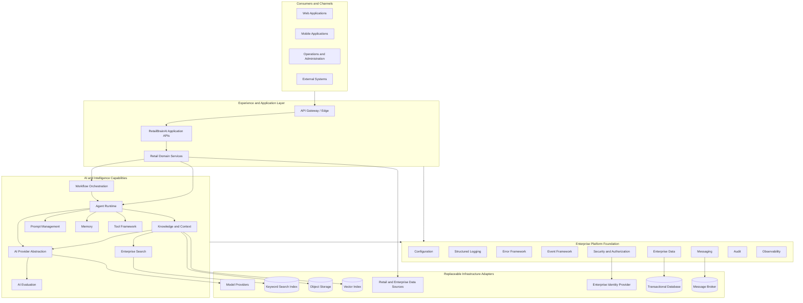
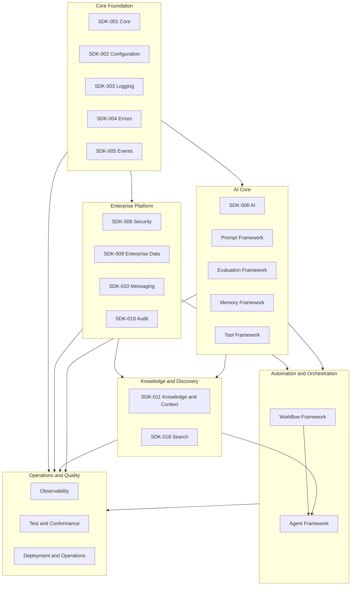
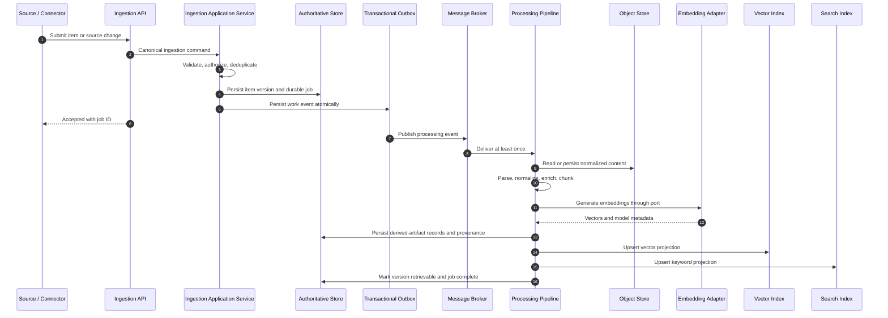
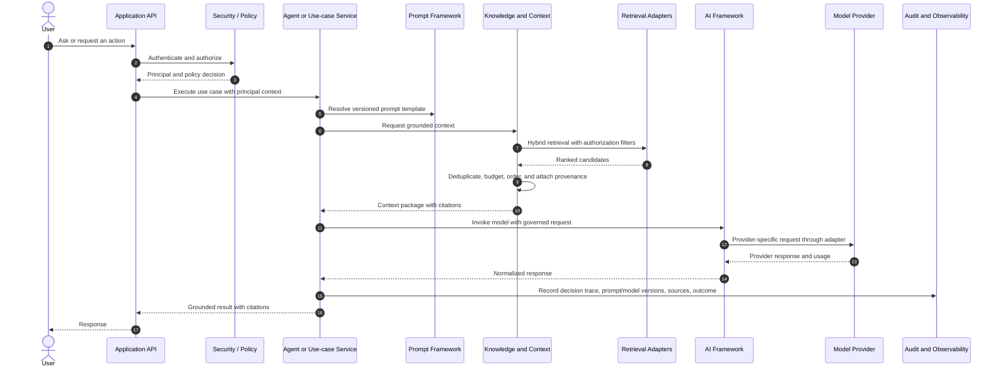
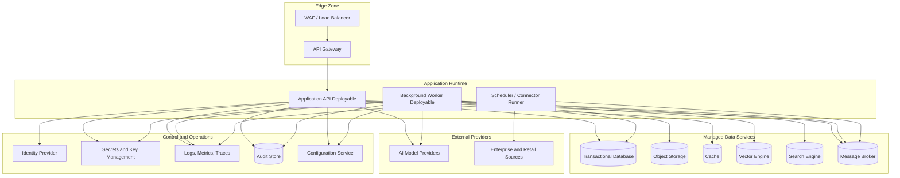
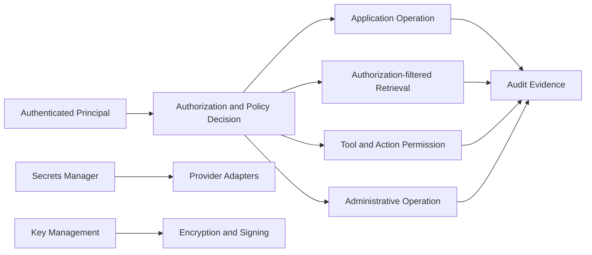

# RetailBrainAI Architecture Overview and Diagrams

## 1. Purpose

This document visualizes and explains the finalized RetailBrainAI architecture baseline. It complements the mandatory [Architecture Principles](01-Architecture-Principles.md) and accepted [Architecture Decisions](02-Architecture-Decisions.md).

The diagrams represent logical ownership and interaction boundaries. An SDK box does **not** imply an independently deployed microservice. Physical deployment shall begin with a modular application or a small number of deployables and shall be decomposed only when scaling, security, availability, ownership, or release-independence evidence justifies the additional operational cost.

## 2. Architecture at a Glance

RetailBrainAI is a capability-oriented enterprise AI platform organized into reusable SDKs. User-facing applications consume stable application APIs. Shared platform SDKs provide configuration, logging, errors, events, AI access, security, data, messaging, knowledge, search, audit, workflow, agent, prompt, evaluation, memory, tool, observability, and operational capabilities. Provider-specific products remain behind adapters.

### 2.1 Interpretation

- **Consumers and channels** never call model providers, vector stores, brokers, or databases directly.
- **Application APIs and domain services** own retail use cases and compose shared SDK capabilities.
- **AI and intelligence SDKs** separate orchestration, model invocation, prompts, evaluation, memory, tools, knowledge grounding, and search.
- **Foundation SDKs** provide mandatory cross-cutting contracts used throughout the platform.
- **Infrastructure products** are accessed only through adapter interfaces. Product-specific types and exceptions must not cross SDK boundaries.

## 3. Logical Layer Model

```mermaid
flowchart LR
  subgraph L1[Layer 1 — Channels]
    C1[Customer Experience]
    C2[Employee Experience]
    C3[Administration]
    C4[System Integrations]
  end

  subgraph L2[Layer 2 — Application and Retail Domain]
    A1[Application APIs]
    A2[Retail Domain Capabilities]
    A3[Use-case Orchestration]
  end

  subgraph L3[Layer 3 — Intelligence Services]
    I1[Agent and Workflow]
    I2[Knowledge and Search]
    I3[Prompt, Memory, Tools]
    I4[AI Invocation and Evaluation]
  end

  subgraph L4[Layer 4 — Shared Platform]
    P1[Security and Policy]
    P2[Data and Messaging]
    P3[Events and Audit]
    P4[Configuration, Errors, Logging, Observability]
  end

  subgraph L5[Layer 5 — Infrastructure]
    X1[Databases and Object Storage]
    X2[Search and Vector Engines]
    X3[Message Brokers]
    X4[Identity and AI Providers]
  end

  L1 --> L2 --> L3 --> L4 --> L5
```

### 3.1 Dependency rules

1. Dependencies flow inward through published contracts; infrastructure adapters depend on domain ports, not the reverse.
2. A higher layer may use a lower layer, but lower layers must not import application or channel code.
3. Cross-SDK interaction uses APIs, application interfaces, or versioned events rather than direct access to another SDK's database tables.
4. Shared domain objects are published as contracts with explicit ownership and versioning; they are not copied and independently modified.
5. SDK boundaries remain enforceable even when modules share one process.

## 4. SDK Capability Map

The finalized roadmap contains SDK-001 through SDK-032. The detailed implementation packs are the source of truth for each capability. The following view groups them by architectural role rather than deployment unit.

### 4.1 Capability ownership

- **SDK-006 AI Framework** owns provider-neutral model invocation, model routing, response normalization, usage data, and AI-provider adapters.
- **SDK-011 Knowledge and Context Framework** owns ingestion, processing, chunking, embeddings orchestration, knowledge metadata, retrieval for grounding, provenance, and context assembly.
- **SDK-018 Search Framework** owns general enterprise keyword, semantic, and hybrid search experiences and search-oriented ranking. It may consume SDK-011 representations without taking ownership of knowledge lifecycle.
- **Agent Framework** owns planning and agent execution. It consumes model, prompt, memory, tool, workflow, knowledge, security, and audit capabilities.
- **Workflow Framework** owns deterministic long-running orchestration, durable state, retries, compensation, and human approval steps.
- **Prompt, Evaluation, Memory, and Tool frameworks** remain separately governed because they have different lifecycles, security risks, versioning, and test requirements.

## 5. Knowledge Ingestion and Indexing Flow

### 5.1 Flow guarantees

- API acceptance is fast and does not wait for parsing or indexing.
- The durable database is authoritative for source versions, jobs, lifecycle state, policies, provenance, and derived-artifact records.
- The outbox prevents accepted work from being lost between database commit and event publication.
- Broker delivery is assumed to be at least once; consumers are idempotent.
- Vector and keyword indexes are rebuildable projections, never the sole system of record.
- A version becomes retrievable only after required processing stages and projections succeed according to policy.
- Deletion and deactivation propagate through durable lifecycle jobs and projection cleanup.

## 6. Grounded AI Request Flow

### 6.1 Grounding and safety rules

- Authorization is evaluated before retrieval and must be carried into retrieval filtering.
- Prompt templates, model configuration, retrieval policy, and context-assembly policy are versioned.
- Retrieved evidence includes stable source and chunk identities, source version, location, score, and policy metadata.
- Context assembly enforces token or size budgets and does not silently discard provenance.
- AI outputs are normalized and recorded with model and prompt versions, but sensitive prompt content and raw source data are excluded from normal logs.
- High-impact actions require deterministic validation, policy checks, and workflow or human approval where specified.

## 7. Runtime and Deployment View

### 7.1 Initial deployment profile

The initial production profile should normally use three application deployables:

1. **Application API:** synchronous endpoints, use-case orchestration, authorization enforcement, and short operations.
2. **Background worker:** ingestion processing, embeddings, indexing, evaluation, durable workflow activities, event consumers, and retries.
3. **Scheduler and connector runner:** source polling, synchronization leases, scheduled jobs, and connector-specific rate control.

These deployables may share SDK modules but must not share mutable in-memory state as a correctness mechanism. State required across requests, processes, or restarts must be persisted.

### 7.2 Scale and decomposition triggers

A module may become a separate deployable when one or more of these conditions is demonstrated:

- materially different scaling profile;
- stronger network or data isolation requirement;
- independent availability or recovery objective;
- incompatible runtime or dependency requirements;
- sustained release contention between owning teams;
- provider rate limiting or workload characteristics requiring independent control;
- measurable operational benefit that exceeds distributed-system complexity.

A decomposition decision requires an ADR and a migration plan covering contracts, state ownership, deployment, observability, failure modes, and rollback.

## 8. Data Ownership and Consistency

| Data category | Authoritative owner | Consistency model | Derived or rebuildable stores |
|---|---|---|---|
| Retail transactional data | Owning retail domain capability | Transactional within its aggregate boundary | Caches, analytical projections |
| Knowledge sources and versions | SDK-011 | Transactional durable state | Search and vector projections |
| Ingestion and processing jobs | SDK-011 / workflow owner | Durable state machine with optimistic concurrency | Operational dashboards |
| Prompt definitions and versions | Prompt framework | Versioned immutable releases | Runtime caches |
| Agent and workflow execution | Agent or workflow framework | Durable execution history | Monitoring views |
| Audit records | SDK-019 | Append-oriented, tamper-evident policy | Reporting projections |
| Events | Owning aggregate via SDK-005 | At-least-once delivery | Consumer projections |
| Model usage and evaluation results | AI and evaluation frameworks | Durable usage/evaluation records | Cost and quality dashboards |

### 8.1 Consistency guidance

- Use local transactions within an owning capability.
- Use events and durable workflows across capability boundaries.
- Do not use distributed transactions across infrastructure products.
- Use idempotency keys, aggregate versions, optimistic concurrency, and reconciliation jobs.
- Make eventual consistency visible through explicit states such as `ACCEPTED`, `PROCESSING`, `RETRIEVABLE`, `FAILED`, and `DEGRADED`.

## 9. Security Architecture

Security is embedded in every layer rather than added only at the edge.

Mandatory controls include:

- least-privilege service and user identities;
- explicit authorization at the owning capability;
- secure references rather than embedded credentials;
- encryption in transit and at rest;
- validation of external references and connector inputs;
- malware and active-content screening where relevant;
- sensitive-data redaction in logs, traces, events, and errors;
- immutable or tamper-evident audit evidence for privileged and AI-sensitive actions;
- controlled tool execution with allow-lists, schemas, timeouts, and output limits;
- no tenant partitioning requirement in the current release, while avoiding identifiers and schemas that make future partitioning impossible.

## 10. Observability and Operations

Every synchronous request, durable job, event, workflow, agent run, model invocation, retrieval, and tool call must be correlated.

Minimum telemetry:

- structured logs with correlation, causation, operation, capability, and safe identity fields;
- distributed traces across API, database, outbox, broker, worker, provider, and index interactions;
- metrics for throughput, latency, errors, retries, queue delay, saturation, provider usage, model cost, retrieval quality, and lifecycle lag;
- audit records for administrative, security-sensitive, data-lifecycle, prompt, model, agent, and tool actions;
- health checks that distinguish process health, dependency health, and workload readiness;
- dashboards and alerts tied to service-level objectives rather than raw infrastructure availability alone.

## 11. Failure and Resilience Model

- Synchronous calls use bounded timeouts and do not retry non-idempotent work blindly.
- Asynchronous handlers use bounded retries with jitter, dead-letter handling, and operator-visible diagnostics.
- Circuit breakers and bulkheads protect the platform from failing external providers.
- Provider degradation may activate configured fallback adapters, but fallback must preserve security, policy, and response-contract requirements.
- Index or cache loss is recovered from authoritative durable state.
- Reconciliation processes detect missed events, stale projections, incomplete lifecycle propagation, and inconsistent job state.
- Every durable state machine defines terminal, retryable, cancelled, and quarantined outcomes.

## 12. Evolution Rules

1. Public APIs, events, schemas, prompts, policies, and AI resource configurations are versioned.
2. Breaking changes require migration guidance and a compatibility window.
3. Provider replacement must be possible without changing domain contracts.
4. Multi-tenancy remains deferred. Introducing it requires a dedicated ADR and impact analysis covering identity, data partitioning, indexes, caches, events, storage paths, encryption, quotas, observability, and migration.
5. New SDKs must not be added during the current frozen-roadmap implementation phase.
6. Material departures from these diagrams require an accepted ADR.
7. The final integrated HTML architecture document shall render equivalent diagrams and link each component to its SDK implementation pack and decision records.

## 13. Claude Code Implementation Guidance

When this architecture folder is copied into an implementation repository, Claude Code must:

1. inspect the repository structure, language, build system, module conventions, testing tools, deployment manifests, and existing architecture before modifying files;
2. map each logical box to existing modules or propose the smallest compatible module structure;
3. preserve the logical boundaries even when implementing them in one deployable;
4. create ports before provider adapters and contract tests before adding multiple providers;
5. implement durable jobs and outbox semantics for long-running workflows;
6. keep authoritative data separate from rebuildable indexes and caches;
7. add Mermaid or generated diagrams to project documentation when the concrete module and deployment names are known;
8. record any unavoidable deviation in an ADR rather than silently changing the architecture;
9. run available tests, formatting, static analysis, and architecture checks after each stage;
10. produce a final implementation report mapping code modules and tests to SDK requirements, principles, decisions, and diagrams.
