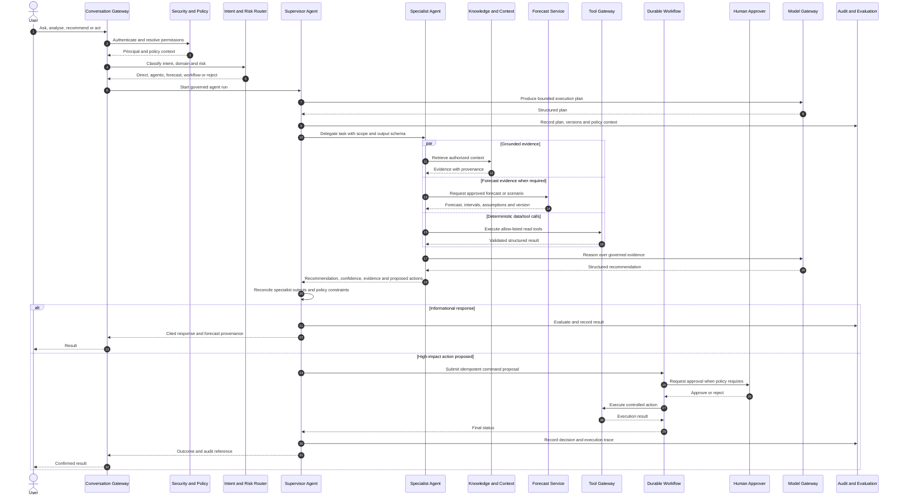
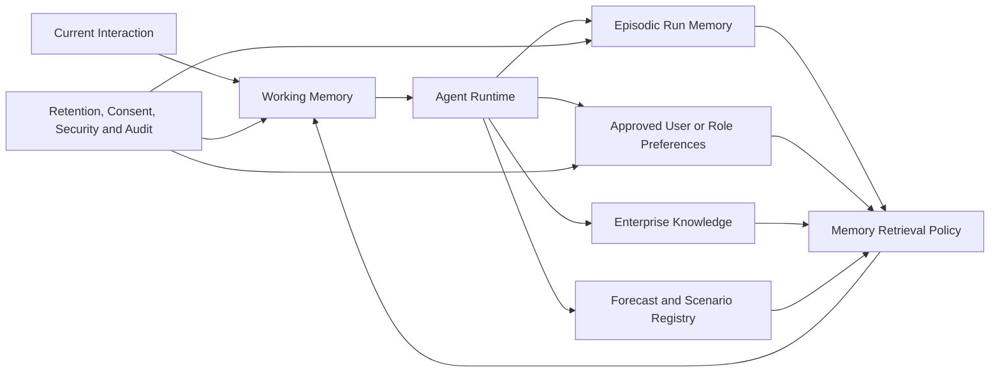

# RetailBrainAI Agentic AI and Forecasting Architecture

## 1. Purpose

This document defines the agentic operating model and forecasting architecture that sit above the RetailBrainAI platform foundations. It makes explicit how user-facing assistants, supervisory agents, specialist agents, deterministic workflows, tools, knowledge grounding, memory, evaluation, and forecasting services work together.

The diagrams show logical ownership. An agent is not automatically a separately deployed service. Multiple agents may execute within one governed agent runtime while retaining separate prompts, policies, tool permissions, evaluation suites, and release lifecycles.

## 2. Agentic AI Architecture at a Glance

```mermaid
flowchart TB
  subgraph Channels[User and System Channels]
    Executive[Executive Workspace]
    Planner[Planning Workspace]
    Merchant[Merchant Workspace]
    Store[Store Operations Workspace]
    Analyst[Analyst Workspace]
    API[External APIs and Events]
  end

  subgraph Entry[Application and Conversation Entry]
    Gateway[Application API and Conversation Gateway]
    Session[Session and Interaction Context]
    Guard[Authentication, Authorization and Policy]
  end

  subgraph AgentPlane[Governed Agent Plane]
    Supervisor[Retail Supervisor Agent]
    Router[Intent, Risk and Capability Router]

    DemandAgent[Demand Planning Agent]
    InventoryAgent[Inventory Optimization Agent]
    PricingAgent[Pricing and Promotion Agent]
    AssortmentAgent[Assortment Agent]
    StoreAgent[Store Operations Agent]
    CustomerAgent[Customer Insight Agent]
    FinanceAgent[Financial Insight Agent]
    KnowledgeAgent[Knowledge and Research Agent]
    DataAgent[Data Analysis Agent]
    ActionAgent[Action Execution Agent]
  end

  subgraph ControlPlane[AI Control and Governance]
    Prompt[Prompt and Instruction Registry]
    Eval[Evaluation and Quality Gates]
    Policy[Agent Policy and Risk Rules]
    Memory[Working, Episodic and Long-Term Memory]
    Audit[Decision Trace and Audit]
    Human[Human Approval and Escalation]
  end

  subgraph Intelligence[Shared Intelligence Services]
    AI[AI Model Gateway and Routing]
    Knowledge[Knowledge and Context Framework]
    Search[Enterprise Search]
    Forecast[Forecasting and Scenario Platform]
    Optimizer[Optimization and Decision Models]
    Tools[Tool Registry and Execution Gateway]
    Workflow[Durable Workflow Orchestration]
  end

  subgraph Data[Retail Data and Projections]
    Sales[(Sales and Transaction Data)]
    Product[(Product and Assortment Data)]
    Inventory[(Inventory and Supply Data)]
    Customer[(Customer and Loyalty Data)]
    Price[(Price and Promotion Data)]
    StoreData[(Store and Operations Data)]
    External[(Market, Weather and External Signals)]
    ForecastStore[(Forecast and Scenario Store)]
  end

  Channels --> Gateway --> Guard --> Session --> Router
  Router --> Supervisor
  Supervisor --> DemandAgent
  Supervisor --> InventoryAgent
  Supervisor --> PricingAgent
  Supervisor --> AssortmentAgent
  Supervisor --> StoreAgent
  Supervisor --> CustomerAgent
  Supervisor --> FinanceAgent
  Supervisor --> KnowledgeAgent
  Supervisor --> DataAgent
  Supervisor --> ActionAgent

  AgentPlane --> Prompt
  AgentPlane --> Policy
  AgentPlane --> Memory
  AgentPlane --> Audit
  AgentPlane --> AI
  AgentPlane --> Knowledge
  AgentPlane --> Forecast
  AgentPlane --> Optimizer
  AgentPlane --> Tools
  AgentPlane --> Workflow

  Policy --> Human
  Workflow --> Human
  Eval --> AgentPlane
  AI --> Eval

  Knowledge --> Search
  Forecast --> ForecastStore
  Forecast --> Sales
  Forecast --> Product
  Forecast --> Inventory
  Forecast --> Customer
  Forecast --> Price
  Forecast --> StoreData
  Forecast --> External
  Optimizer --> ForecastStore
  Tools --> Data
  ActionAgent --> Workflow
```



### 2.1 Interpretation

- The **Retail Supervisor Agent** owns decomposition, delegation, synthesis, and final response assembly for multi-domain requests.
- The **router** determines whether a request should be answered directly, delegated to a specialist, executed as a deterministic workflow, sent to forecasting or optimization, or escalated for human approval.
- Specialist agents own domain reasoning, not unrestricted platform access. Each specialist receives an explicit tool allow-list, data scope, risk policy, and output contract.
- Forecasts and optimization results are governed analytical products. Agents consume them through stable contracts and must not invent forecast values when an authoritative forecast is available.
- The **Action Execution Agent** cannot directly perform high-impact writes. It submits commands to durable workflows that apply authorization, validation, approvals, idempotency, compensation, and audit controls.

## 3. Agent Portfolio and Responsibilities

| Agent | Primary responsibilities | Primary dependencies | Typical outputs |
|---|---|---|---|
| Retail Supervisor Agent | Interpret complex requests, create plans, delegate work, reconcile conflicts, synthesize final responses | Agent policy, prompts, memory, all specialist agents | Delegation plan, consolidated recommendation, execution proposal |
| Demand Planning Agent | Explain demand patterns, request forecasts, compare scenarios, identify forecast risk | Forecasting platform, sales, product, events, external signals | Demand forecast explanation, scenario comparison, forecast exceptions |
| Inventory Optimization Agent | Evaluate stock positions, service risk, replenishment options and allocation implications | Demand forecasts, inventory, supply, optimizer | Replenishment recommendation, stock-risk summary, transfer proposal |
| Pricing and Promotion Agent | Evaluate price, markdown and promotion choices against demand, margin and constraints | Price/promotion data, demand forecast, optimizer, policy | Promotion scenario, markdown recommendation, expected impact |
| Assortment Agent | Analyse range performance, localization, gaps and item rationalization | Product, sales, customer, store clusters, forecasts | Assortment recommendation, delist/add proposal, cluster plan |
| Store Operations Agent | Support store execution, exceptions, tasks, labour and operational knowledge | Store data, workflows, knowledge, tools | Store action plan, exception summary, operational task proposal |
| Customer Insight Agent | Analyse segments, behaviour, journeys and campaign implications | Customer data, privacy policy, analytics tools | Segment insight, opportunity summary, campaign audience proposal |
| Financial Insight Agent | Connect operational choices to revenue, margin, cost and plan outcomes | Finance data, forecasts, scenarios | Financial impact, variance explanation, plan outlook |
| Knowledge and Research Agent | Retrieve governed enterprise knowledge and produce cited answers | SDK-011, search, prompt framework | Evidence package, cited answer, policy or procedure explanation |
| Data Analysis Agent | Execute approved analytical queries, profiling and diagnostic calculations | Data framework, analytics tools, sandboxed compute | Tables, metrics, anomaly explanation, reproducible analysis |
| Action Execution Agent | Convert approved recommendations into governed commands and workflows | Tool gateway, workflow, security, audit, human approval | Command proposal, workflow status, execution result |

## 4. Agent Execution Model



### 4.1 Agent run contract

Every agent run shall record or reference:

- run, session, correlation and causation identifiers;
- authenticated principal and authorization decision;
- agent definition and version;
- prompt, policy, model, tool and retrieval-policy versions;
- task objective, constraints, output schema and risk class;
- delegated child runs and dependency graph;
- evidence, forecast and tool-result references;
- confidence or uncertainty information where meaningful;
- proposed and executed actions;
- evaluation results, human decisions and terminal outcome.

## 5. Forecasting Architecture

Forecasting is a governed platform capability, not a prompt-only activity. Forecast generation, reconciliation, evaluation, publication, override and consumption are versioned and auditable.

```mermaid
flowchart LR
  subgraph Inputs[Curated Forecast Inputs]
    History[Sales and Demand History]
    Product[Product Hierarchies and Attributes]
    Price[Price and Promotion]
    Inventory[Availability and Stock-outs]
    Calendar[Calendar and Events]
    External[Weather, Market and External Signals]
    Overrides[Approved Business Assumptions]
  end

  subgraph Pipeline[Forecast Pipeline]
    Validate[Data Quality and Eligibility]
    Features[Feature Generation]
    Train[Training and Model Selection]
    Generate[Baseline Forecast Generation]
    Reconcile[Hierarchy and Temporal Reconciliation]
    Calibrate[Intervals and Uncertainty Calibration]
    Evaluate[Backtesting and Accuracy Evaluation]
    Approve[Policy Gate and Publication]
  end

  subgraph Products[Forecast Products]
    Demand[Demand Forecast]
    Sales[Sales Forecast]
    InventoryF[Inventory Projection]
    Promo[Promotion Uplift Forecast]
    Finance[Revenue and Margin Outlook]
    Scenario[Scenario Forecasts]
  end

  subgraph Consumers[Consumers]
    DemandAgent[Demand Planning Agent]
    InventoryAgent[Inventory Optimization Agent]
    PricingAgent[Pricing and Promotion Agent]
    AssortmentAgent[Assortment Agent]
    FinanceAgent[Financial Insight Agent]
    Optimizer[Optimization Services]
    Reports[Planning and Reporting]
    Alerts[Exception and Alert Services]
  end

  Inputs --> Validate --> Features --> Train --> Generate --> Reconcile --> Calibrate --> Evaluate --> Approve
  Approve --> Demand
  Approve --> Sales
  Approve --> InventoryF
  Approve --> Promo
  Approve --> Finance
  Approve --> Scenario

  Products --> Consumers
  Overrides --> Generate
  Evaluate -. performance feedback .-> Train
  Consumers -. realized outcomes .-> History
```



### 5.1 Forecast product contract

Each published forecast shall include:

- forecast identifier and immutable version;
- forecast type, target measure and unit;
- entity and hierarchy grain;
- issue time, valid time and horizon;
- point estimate and, where supported, prediction intervals or quantiles;
- model, feature-set, dataset and pipeline versions;
- hierarchy-reconciliation method;
- input cutoff and data-quality status;
- assumptions, exclusions and known limitations;
- accuracy metrics at relevant hierarchy levels;
- baseline, override and final approved values where overrides exist;
- approval status, owner, reason and audit trail;
- lineage to scenarios, recommendations and actions that consumed it.

## 6. Forecast-to-Decision Loop

```mermaid
sequenceDiagram
  autonumber
  participant Trigger as Schedule or Business Event
  participant Pipeline as Forecast Pipeline
  participant Registry as Forecast Registry
  participant Eval as Forecast Evaluation
  participant Agent as Planning Specialist Agent
  participant Opt as Optimization Service
  participant Policy as Decision Policy
  participant Workflow as Planning Workflow
  participant User as Planner or Approver
  participant Actuals as Actual Outcomes

  Trigger->>Pipeline: Start forecast run with cutoff and horizon
  Pipeline->>Pipeline: Validate, feature, train/select and forecast
  Pipeline->>Eval: Backtest and calculate quality metrics
  Eval-->>Pipeline: Quality gate result
  alt Quality gate passes
    Pipeline->>Registry: Publish immutable forecast version
    Registry-->>Agent: Forecast-available event
    Agent->>Registry: Read forecast, intervals and assumptions
    Agent->>Opt: Request constrained decision options
    Opt-->>Agent: Ranked options and trade-offs
    Agent->>Policy: Validate recommendation and risk
    Policy-->>Agent: Allowed, approval-required or blocked
    Agent->>Workflow: Create planning proposal
    Workflow->>User: Review recommendation and evidence
    User-->>Workflow: Approve, modify or reject
    Workflow->>Registry: Record approved override or scenario
  else Quality gate fails
    Pipeline->>Registry: Record rejected candidate
    Pipeline-->>User: Raise forecast-quality exception
  end

  Actuals->>Eval: Supply realized outcomes
  Eval->>Registry: Publish accuracy and bias results
  Eval-->>Pipeline: Trigger retraining or investigation policy
```

### 6.1 Decision rules

- Agents shall use the latest **approved** forecast applicable to the requested grain, horizon and scenario unless the user explicitly selects another version.
- Forecast values, intervals, assumptions and versions must be cited in recommendations.
- Agents may explain or compare forecasts but shall not silently replace approved forecasts with LLM-generated numbers.
- Business overrides must remain distinct from statistical baselines and require actor, reason, scope and expiry metadata.
- Optimization must consume immutable forecast versions and return the exact input version in its result.
- High-impact recommendations must expose uncertainty, alternatives, constraints and expected trade-offs.
- Realized outcomes must feed forecast evaluation, bias monitoring and agent recommendation evaluation.

## 7. Multi-Agent Coordination Patterns

RetailBrainAI permits the following governed patterns:

1. **Router to specialist:** a single-domain request is delegated directly to one specialist agent.
2. **Supervisor with parallel specialists:** independent analyses run concurrently and are synthesized by the supervisor.
3. **Supervisor with dependency chain:** one specialist's output becomes a validated input to another, such as demand forecast before inventory optimization.
4. **Agent plus deterministic workflow:** the agent prepares a proposal while the workflow owns durable execution and approvals.
5. **Agent plus optimizer:** the agent frames objectives and explains outcomes; the optimizer performs constrained mathematical selection.
6. **Human-in-the-loop:** the agent pauses at an approval or information boundary and resumes using the recorded decision.

Unbounded agent-to-agent conversation, unrestricted recursive delegation and self-authorized tool escalation are prohibited.

## 8. Tool and Action Safety

Tools are separated into risk classes:

- **Read tools:** retrieve authorized data or status without changing business state.
- **Analytical tools:** run bounded queries, calculations, simulations or forecasts in controlled environments.
- **Proposal tools:** create draft plans, recommendations or commands without execution.
- **Write tools:** change business state and therefore require explicit authorization, validation, idempotency and audit.
- **High-impact tools:** affect price, inventory, customer communication, finance, access, large-scale operations or external commitments and normally require workflow or human approval.

The model never receives provider credentials. Tool credentials are resolved by the execution gateway after policy approval. Tool outputs are schema-validated before returning to an agent.

## 9. Memory Architecture



Working context, episodic memory, approved preferences, enterprise knowledge and forecast products are separate stores with separate lifecycle and authorization rules. Conversation history must not become durable memory by default.

## 10. Evaluation and Operational Controls

The agentic platform shall evaluate:

- routing and delegation accuracy;
- task completion and output-schema compliance;
- factual grounding and citation correctness;
- forecast selection and version correctness;
- numerical consistency and deterministic validation;
- tool selection, argument validity and authorization compliance;
- policy violations, unsafe proposals and approval bypass attempts;
- recommendation quality and realized business outcomes;
- latency, cost, token usage and tool-call volume;
- agent, prompt, model, retrieval and forecast-version regressions.

Production releases require offline test suites, adversarial safety tests, tool conformance tests, forecast-contract tests and controlled online monitoring.

## 11. Deployment Interpretation

The logical agent portfolio may initially run as modules inside:

- the application API deployable for bounded synchronous interactions;
- the background worker deployable for long-running agent runs, forecasts and evaluation;
- the scheduler/connector deployable for recurring forecast and data-refresh jobs.

Separate agent or forecast services are justified only by measured scale, isolation, ownership, release cadence, technology or availability requirements. Logical separation, independent configuration and auditability are mandatory even when deployment is shared.

## 12. Architecture Outcomes

This architecture makes agents an explicit governed platform layer rather than a generic model call. It makes forecasting an authoritative analytical capability rather than informal LLM reasoning. Together they establish a closed loop from data, knowledge and forecasts to recommendations, approvals, actions, realized outcomes and continuous evaluation.