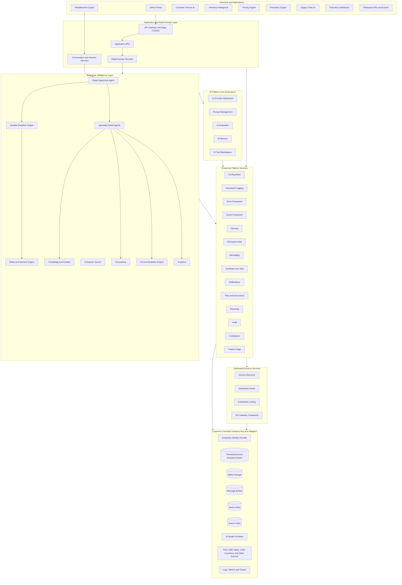
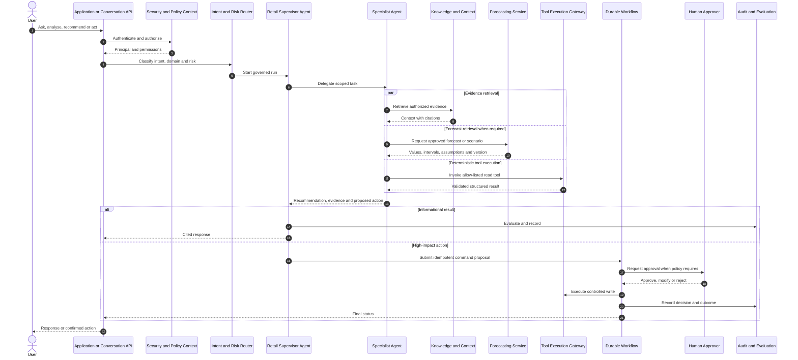
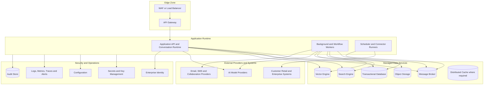

# RetailBrainAI Final Production Architecture and Business Capabilities

## 1. Document status and authority

This document is the consolidated production architecture for RetailBrainAI. It brings together the approved architecture principles and decisions, the SDK-001 through SDK-032 roadmap, the production implementation packs, the agentic AI architecture, the forecasting architecture, and the RetailBrainAI application scenarios.

It is intended to support direct implementation and deployment in a customer-controlled enterprise environment. It is not an MVP, proof of concept, prototype, or vendor demonstration architecture.

The detailed SDK implementation packs remain authoritative for SDK-level requirements and Claude Code execution instructions. This document is authoritative for platform-wide structure, capability ownership, cross-SDK interaction, business scenarios, production qualities, deployment boundaries, and end-to-end acceptance.

### 1.1 Scope rules

1. SDK identifiers, names, purposes, dependencies, phases, priorities, and completion states are preserved exactly from the approved roadmap.
2. No additional SDK is introduced by this document.
3. Phase 1 SDKs are treated as completed foundations requiring conformance validation and production hardening where gaps are found.
4. Current deployment assumes one enterprise installation. Multi-tenant isolation is deferred.
5. Logical SDK boundaries do not require one microservice per SDK.
6. Provider products remain behind adapters and do not define public domain contracts.
7. AI-generated outputs are governed by deterministic security, policy, validation, workflow, audit, and human-approval controls.

---

## 2. Business objective

RetailBrainAI provides a governed enterprise AI and intelligence platform for retail operations. The platform enables reusable capabilities for configuration, security, data, messaging, workflow, knowledge, agents, decisioning, documents, reporting, search, compliance, AI governance, analytics, recommendations, and forecasting.

The platform supports applications for administration, enterprise copilot experiences, customer service automation, inventory intelligence, pricing, promotions, supply-chain intelligence, and executive decision support.

The business outcomes supported by the architecture are:

- faster and more consistent access to governed enterprise knowledge;
- evidence-based answers with citations and provenance;
- coordinated multi-agent analysis across retail domains;
- durable automation of operational and approval workflows;
- governed business-rule and policy execution;
- improved demand, sales, inventory, revenue, and margin planning;
- controlled recommendations for inventory, pricing, promotions, assortment, and supply chain;
- auditable AI decisions and actions;
- production deployment in customer infrastructure with secure configuration and operational handover.

---

## 3. Architecture principles

The platform follows these mandatory principles:

1. **Capability-oriented SDK boundaries.** Each SDK owns a defined reusable platform capability.
2. **Contract-first design.** Public APIs, events, commands, schemas, and ports are versioned before provider implementation details.
3. **Ports and adapters.** Domain and application layers remain provider-neutral; infrastructure SDKs and vendor libraries stay inside adapters.
4. **Modular-first deployment.** SDKs are logical boundaries. Initial deployment uses a modular application and a small number of runtime processes unless independent scaling, security, availability, ownership, or release cadence justifies separation.
5. **Durable execution for long-running work.** Workflows, jobs, ingestion, notifications, forecasting, indexing, and high-impact actions survive process restarts and infrastructure failures.
6. **Event-driven integration with explicit consistency.** Events are versioned; at-least-once delivery is assumed; consumers are idempotent; transactional outbox patterns protect accepted work.
7. **Authoritative durable state.** Databases and registries hold authoritative lifecycle and lineage records. Search, vector, cache, and analytical projections are rebuildable.
8. **Security and governance by default.** Authentication, authorization, identity propagation, data classification, secret management, audit, policy enforcement, and safe telemetry apply across all capabilities.
9. **Deterministic controls around probabilistic AI.** Models may plan, summarize, classify, explain, and recommend, but security, validation, approval, execution, and material business writes remain deterministic and auditable.
10. **Provenance and traceability.** Knowledge, prompts, models, agents, tools, forecasts, rules, recommendations, and actions are versioned and traceable.
11. **Customer-place operability.** Every production release includes deployment, configuration, migration, monitoring, backup, restore, upgrade, rollback, troubleshooting, and acceptance evidence.

---

## 4. Enterprise architecture at a glance

### 4.1 Interpretation

- Applications consume stable platform and domain contracts; they do not directly call databases, brokers, vector stores, identity providers, or model-provider SDKs.
- The agent plane coordinates reasoning but does not bypass security, rules, workflows, approvals, or application ownership.
- Forecasting and recommendation outputs are governed analytical products, not unverified model text.
- Search and vector stores are projections. Knowledge lifecycle and provenance remain owned by SDK-011.
- Distributed services are introduced when required by deployment topology and scale; they do not force premature service decomposition.

---

## 5. SDK capability architecture

### 5.1 Phase 1 – Platform Foundation — complete

| SDK | Capability | Production responsibility |
|---|---|---|
| SDK-001 | Platform Standards & Common Types | Shared types, coding standards and common utilities. Optional/internal according to the roadmap. |
| SDK-002 | Configuration Framework | Typed configuration loading, validation, environment overlays, secure external configuration and diagnostics. |
| SDK-003 | Structured Logging Framework | Structured logs, correlation and causation identifiers, redaction and OpenTelemetry integration. |
| SDK-004 | Error Framework | Stable platform error contracts, classification, retry semantics, safe external error mapping and diagnostics. |
| SDK-005 | Event Framework | Domain event contracts, versioning, metadata, publishing abstractions and event-handling conventions. |
| SDK-006 | AI Framework | Provider-independent model invocation, prompt execution, normalized responses, tool-call contracts, routing and usage telemetry. |
| SDK-007 | Workflow Engine | Durable orchestration, state, retries, compensation, timeout handling, approvals and recovery. |
| SDK-008 | Security Framework | Authentication, authorization, identity propagation, policy context, secret integration and secure defaults. |
| SDK-009 | Enterprise Data Framework | Repository, unit of work, specifications, transactions, migrations and provider-neutral persistence. |
| SDK-010 | Messaging Framework | Provider-independent queues and topics, publish/subscribe, retry, dead-letter handling and delivery observability. |

These SDKs form the mandatory production baseline. Downstream work must validate their published contracts and cannot silently replace them.

### 5.2 Phase 2 – Enterprise Intelligence

| SDK | Capability | Production responsibility |
|---|---|---|
| SDK-011 | Knowledge & Context Framework | Governed ingestion, parsing, chunking, embeddings, vector retrieval, RAG, context assembly, lifecycle and provenance. |
| SDK-012 | Agent Framework | Multi-agent planning, delegation, reflection, structured runs, tool execution, policy enforcement and run traceability. |
| SDK-013 | Rules & Decision Engine | Business rules, decision tables, expression evaluation, policy decisions, explainability and versioned rule deployment. |
| SDK-014 | Scheduler & Background Jobs | Cron, recurring jobs, durable jobs, distributed scheduling, ownership, misfire handling and operational controls. |

### 5.3 Phase 3 – Enterprise Operations

| SDK | Capability | Production responsibility |
|---|---|---|
| SDK-015 | Notification Framework | Email, SMS, Teams, Slack, push and WhatsApp abstractions, templates, delivery state, retry and provider failover policy. |
| SDK-016 | File & Document Framework | Blob abstraction, document metadata, OCR, PDF generation, versioning, secure access and lifecycle. |
| SDK-017 | Reporting Framework | Reports, dashboards, exports, scheduled reporting, authorization, reproducibility and delivery. |
| SDK-018 | Search Framework | Full-text, faceted, semantic and hybrid search with indexing abstraction, ranking, filtering and rebuild support. |

### 5.4 Phase 4 – Governance & Compliance

| SDK | Capability | Production responsibility |
|---|---|---|
| SDK-019 | Audit Framework | Immutable activity and AI audit records, integrity, search, retention and evidence export. |
| SDK-020 | Compliance Framework | GDPR, HIPAA, SOC 2, PCI-DSS, retention, consent, legal hold and policy enforcement as required by customer scope. |
| SDK-021 | Feature Flag Framework | Feature toggles, progressive rollout, canary controls, A/B testing and auditable flag changes. |

### 5.5 Phase 5 – AI Platform Services

| SDK | Capability | Production responsibility |
|---|---|---|
| SDK-022 | Prompt Management Framework | Prompt registry, versioning, approval, testing, release, rollback and environment promotion. |
| SDK-023 | AI Evaluation Framework | Groundedness, hallucination, toxicity and quality evaluation with release and runtime gates. |
| SDK-024 | AI Memory Framework | Session, episodic, semantic and long-term memory with scope, retention, privacy, retrieval and deletion controls. |
| SDK-025 | AI Tool Marketplace | Tool discovery, registration, versioning, permission metadata, plugin catalog and controlled execution integration. |

### 5.6 Phase 6 – Distributed Platform Services

| SDK | Capability | Production responsibility |
|---|---|---|
| SDK-026 | Service Discovery Framework | Provider-neutral service registration and discovery for Kubernetes, Consul or Eureka environments. |
| SDK-027 | Distributed Cache Framework | Redis, Hazelcast or equivalent adapters, cache policy, invalidation, serialization, telemetry and degraded behavior. |
| SDK-028 | Distributed Locking Framework | Safe distributed synchronization, ownership, fencing, lease renewal and recovery using cache or SQL providers. |
| SDK-029 | API Gateway Framework | Routing, rate limits, authentication integration, transformation, policy application and gateway telemetry. |

### 5.7 Phase 7 – Platform Intelligence

| SDK | Capability | Production responsibility |
|---|---|---|
| SDK-030 | Analytics Framework | Platform metrics, business KPIs, AI-usage analytics, governed metric definitions and reproducible calculations. |
| SDK-031 | Recommendation Engine | Product recommendations, personalization, ranking, evaluation and policy-controlled serving. |
| SDK-032 | Forecasting Framework | Demand, sales and inventory forecasting with reproducible pipelines, uncertainty, reconciliation, evaluation, publication and monitoring. |

---

## 6. Agentic AI operating model

RetailBrainAI uses a governed supervisor-and-specialist model. Multiple agents may execute inside one agent runtime while retaining independent definitions, prompts, policies, permissions, evaluations and release versions.

### 6.1 Agent portfolio

| Agent | Business function | Core outputs |
|---|---|---|
| Retail Supervisor Agent | Interprets complex requests, plans work, delegates, reconciles results and assembles the final response. | Execution plan, consolidated recommendation, action proposal. |
| Demand Planning Agent | Explains demand, compares scenarios and identifies forecast exceptions. | Forecast explanation, exception list, scenario comparison. |
| Inventory Optimization Agent | Evaluates stock, service risk, replenishment and allocation. | Replenishment recommendation, transfer proposal, stock-risk summary. |
| Pricing and Promotion Agent | Evaluates pricing, markdowns and promotion choices. | Price or promotion scenario, expected demand and margin impact. |
| Assortment Agent | Analyses range performance, localization, gaps and rationalization. | Add, remove, localize or cluster recommendation. |
| Store Operations Agent | Supports store execution, tasks, exceptions and operational procedures. | Store action plan, task proposal, exception explanation. |
| Customer Insight Agent | Analyses customer behaviour and segments under privacy controls. | Segment insight, campaign audience proposal, journey finding. |
| Financial Insight Agent | Connects operational choices with revenue, margin, cost and plan. | Financial impact and variance explanation. |
| Knowledge and Research Agent | Produces governed, cited answers from enterprise knowledge. | Evidence package and cited response. |
| Data Analysis Agent | Runs approved analytical queries and diagnostics. | Reproducible metrics, tables and anomaly analysis. |
| Action Execution Agent | Converts approved recommendations into controlled commands and workflows. | Command proposal, execution status and audit reference. |

### 6.2 Agent execution controls

Every agent run carries:

- authenticated principal and authorization context;
- run, session, correlation and causation identifiers;
- agent, prompt, policy, model, retrieval and tool versions;
- task objective, constraints, risk class and output schema;
- child-run and dependency graph;
- evidence, forecast and tool-result references;
- confidence or uncertainty where meaningful;
- proposed and executed actions;
- evaluation results, human decisions and terminal outcome.

Specialist agents use explicit tool allow-lists and scoped data access. High-impact writes are submitted to SDK-007 workflows. Workflows apply SDK-008 authorization, SDK-013 policy decisions, idempotency, validation, approvals, compensation and SDK-019 audit recording.

### 6.3 Governed request flow

---

## 7. Knowledge, search and grounded AI

SDK-011 owns the knowledge lifecycle. SDK-018 owns enterprise search experiences and ranking. SDK-006 owns model invocation. SDK-012 owns agent execution. These boundaries prevent search, agents or model providers from becoming uncontrolled systems of record.

### 7.1 Knowledge ingestion lifecycle

1. A connector, user or application submits content or a source-change event.
2. The ingestion API validates identity, authorization, metadata, classification and duplicate conditions.
3. The authoritative store records the source item, immutable version, lifecycle state and durable processing job.
4. A transactional outbox records work atomically with the accepted state.
5. Messaging delivers processing work at least once.
6. Workers parse, normalize, enrich and chunk content.
7. Embeddings are generated through SDK-006 provider-neutral ports.
8. Derived-artifact and provenance records are stored authoritatively.
9. Vector and keyword projections are updated idempotently.
10. A version becomes retrievable only when required processing and policy gates succeed.
11. Update, deactivation, retention and deletion propagate through durable lifecycle jobs.

### 7.2 Grounded answer requirements

A grounded answer includes stable source and chunk identities, source version, location and retrieval metadata. Authorization is applied before and during retrieval. Context assembly enforces size or token budgets without silently dropping provenance. Prompt, model, retrieval and context policies are versioned. Sensitive prompt or source content is excluded from normal telemetry.

---

## 8. Forecasting architecture

SDK-032 is a governed forecasting platform. Forecasts are not generated by prompting an LLM. Agents consume approved forecast products through stable contracts.

### 8.1 Forecast lifecycle

```mermaid
flowchart LR
  Inputs[Sales, product, price, promotion, inventory, calendar, events and approved external signals]
  Validate[Data quality and eligibility]
  Features[Reproducible feature snapshots]
  Train[Training and candidate selection]
  Generate[Baseline generation]
  Reconcile[Hierarchy and temporal reconciliation]
  Calibrate[Intervals and uncertainty calibration]
  Backtest[Backtesting, bias and accuracy]
  Gate[Policy and publication gate]
  Registry[(Immutable forecast registry)]
  Consumers[Agents, optimizers, reports, alerts and applications]
  Actuals[Realized outcomes]

  Inputs --> Validate --> Features --> Train --> Generate --> Reconcile --> Calibrate --> Backtest --> Gate --> Registry --> Consumers
  Actuals --> Backtest
  Backtest -. retraining and challenger feedback .-> Train
```

### 8.2 Published forecast contract

Each published forecast records:

- immutable forecast identifier and version;
- forecast type, target measure and unit;
- entity and hierarchy grain;
- issue time, valid time, cutoff and horizon;
- point estimate and supported intervals or quantiles;
- model, feature-set, dataset and pipeline versions;
- reconciliation and calibration methods;
- data-quality state and input exclusions;
- assumptions and known limitations;
- accuracy and bias metrics at relevant levels;
- baseline, approved override and final values;
- approval owner, reason and audit trail;
- lineage to scenarios, recommendations and actions that consumed the forecast.

### 8.3 Forecast quality and fallback

Forecast candidates must pass data, backtesting and policy gates before publication. Rejected candidates are retained for traceability but cannot become authoritative. Production operation includes drift and accuracy monitoring, retraining triggers, champion/challenger evaluation, rollback to a prior approved version, and a documented deterministic fallback where current forecasts are unavailable or unsafe.

---

## 9. Rules, workflows and controlled actions

SDK-013 owns deterministic business rules, decision tables, policy evaluation and explainability. SDK-007 owns durable workflow state and execution. SDK-012 agents may propose actions but do not replace either capability.

A material action follows this sequence:

1. The agent or application proposes a typed command.
2. SDK-008 verifies identity and permission.
3. SDK-013 evaluates business rules, constraints and approval requirements.
4. SDK-007 creates or resumes an idempotent workflow.
5. Required human approval is collected and recorded.
6. The action is executed through an approved SDK-025 tool or application adapter.
7. Compensation or retry logic handles recoverable failures.
8. SDK-019 records the decision and execution trail.
9. SDK-005 publishes outcome events.
10. Applications and analytics consume the confirmed outcome rather than an uncommitted AI suggestion.

---

## 10. Data architecture

### 10.1 Data ownership

- SDK-009 supplies provider-independent persistence and transaction patterns.
- Each capability owns its authoritative records and schema evolution.
- Other SDKs access capability data through published APIs, application services or versioned events, not direct cross-SDK table access.
- Search indexes, vector indexes, caches, dashboards and analytical views are projections.
- Source records, lifecycle state, jobs, prompts, rules, agent definitions, forecasts, recommendations, approvals and audit evidence have explicit owners and versions.

### 10.2 Consistency patterns

- Local transactions protect authoritative state changes.
- Transactional outbox patterns couple state commits with event publication.
- Message delivery is assumed to be at least once.
- Consumers use idempotency keys, version checks or inbox records.
- Long-running work exposes durable status and retry state.
- Projection lag and reconciliation are observable.
- Manual database edits are not a normal operational procedure.

### 10.3 Governance

Data contracts define classification, validation, retention, deletion, provenance and schema versions. SDK-020 applies customer-required retention, consent, legal-hold and compliance policies. SDK-019 records material data and AI activity. Current deployment is single-enterprise; authorization and data classification still apply to users, roles, business domains and resources.

---

## 11. Integration architecture

RetailBrainAI integrates with customer systems through provider-neutral adapters, APIs, events, scheduled connectors and governed tools.

Typical sources and targets include POS, ERP, WMS, order management, product information, pricing, promotion, customer and loyalty, commerce, finance, workforce, collaboration, document repositories and approved external signal providers.

Integration requirements include:

- explicit source ownership and credentials;
- schema and contract versioning;
- secure transport and secret rotation;
- incremental extraction or change capture where available;
- idempotent ingestion and replay;
- rate limiting, timeout and retry policies;
- dead-letter handling and reconciliation;
- source-to-platform lineage;
- health, freshness, lag and failure monitoring;
- customer-controlled enablement and configuration.

SDK-014 runs scheduled connectors and jobs. SDK-010 carries messages. SDK-005 defines events. SDK-016 manages files and documents. SDK-025 registers AI-accessible tools, but registration does not automatically authorize use.

---

## 12. Security architecture

### 12.1 Identity and authorization

All entry points authenticate users, workloads or external systems. Identity and authorization context is propagated across APIs, messages, workflows, agent runs and tool calls. Permissions are least privilege and evaluated at the resource and action level.

### 12.2 AI-specific security

- Prompts and agent instructions are versioned and approved.
- Retrieved content is treated as untrusted input and cannot override system policy.
- Tool calls use typed schemas, allow-lists, scoped credentials and validation.
- Agents cannot obtain broader access than the authenticated principal and assigned service policy.
- High-impact writes require deterministic authorization and workflow controls.
- Model and tool outputs are validated before use.
- Secrets, personal data and sensitive source content are redacted from normal logs and traces.
- Evaluation and abuse-case tests cover prompt injection, data exfiltration, unsafe tool use and policy bypass.

### 12.3 Infrastructure security

Customer deployment uses external secret management, encryption in transit and at rest where applicable, network segmentation, workload identity, dependency and container scanning, hardened base images, patching procedures and auditable administrative access.

---

## 13. Deployment architecture

The initial production topology uses a small number of independently scalable deployables while retaining SDK module boundaries.

### 13.1 Service extraction criteria

An SDK or module becomes a separate service only when evidence shows a requirement for independent scaling, stronger isolation, different availability objectives, separate ownership, distinct release cadence, technology constraints or regulatory boundaries. Extraction requires stable contracts, independent data ownership, operational readiness and an architecture decision.

### 13.2 Availability and recovery

Production deployment defines service-level objectives, capacity assumptions, resource limits, readiness and liveness probes, graceful shutdown, back-pressure, retry budgets, circuit breakers, backup and restore, disaster recovery, recovery-time objectives and recovery-point objectives according to customer requirements.

---

## 14. Observability and audit

Every production path emits correlated telemetry using SDK-003 and the platform observability conventions.

Required operational signals include:

- request, workflow, job, agent-run and forecast-run latency;
- success, rejection, retry, timeout and terminal-failure counts;
- queue depth, delivery lag and dead-letter volume;
- connector freshness and ingestion backlog;
- indexing lag and projection reconciliation state;
- model-provider latency, error rate, token or usage data and routing decisions;
- agent delegation, tool execution, policy denial and human escalation metrics;
- forecast accuracy, bias, coverage, drift and stale-publication indicators;
- cache hit rate and distributed-lock contention where applicable;
- notification delivery and provider failure state;
- customer-facing availability and critical business SLOs.

SDK-019 records immutable material activity, AI decisions, rule results, approvals, tool executions and action outcomes. Operational telemetry is not a substitute for audit evidence, and audit records must not expose secrets unnecessarily.

---

## 15. Business scenarios

### 15.1 Admin Portal

**Purpose:** platform administration and monitoring.

**Scenario:** An authorized administrator configures model providers, connectors, policies, prompt releases, feature flags and notification channels; reviews health, job backlogs, audit records and usage; and performs controlled operational actions.

**Primary capabilities:** SDK-002, SDK-003, SDK-008, SDK-014, SDK-019, SDK-021, SDK-022, SDK-023, SDK-025, SDK-030 and applicable operational SDKs.

**Production controls:** role-based administration, secret references rather than exposed credentials, dual control for sensitive changes where required, full audit trail, configuration validation, rollback and operational diagnostics.

### 15.2 RetailBrainAI Copilot

**Purpose:** enterprise AI assistant.

**Scenario:** A user asks a cross-domain question such as why sales declined, which stores or products contributed, what current forecasts indicate and what actions are recommended. The supervisor agent delegates to knowledge, data, demand, inventory and financial specialists, then returns a cited synthesis with forecast provenance and clearly separated recommendations.

**Primary capabilities:** SDK-006, SDK-011, SDK-012, plus security, prompt, evaluation, memory, tools, analytics, forecasting and audit capabilities as the use case requires.

**Production controls:** authorization-filtered retrieval, cited evidence, approved forecast consumption, structured agent outputs, model and prompt version traceability, evaluation, sensitive-data protection and human approval before action.

### 15.3 Customer Service AI

**Purpose:** customer support automation.

**Scenario:** A service agent or approved automated channel receives a customer query, retrieves policies and order context, proposes or sends a response, and starts a durable workflow for an allowed service action.

**Primary capabilities:** SDK-006, SDK-007, SDK-011 and SDK-015, with security, audit, compliance, prompt, evaluation, memory and tool controls.

**Production controls:** customer identity verification, privacy scope, response grounding, escalation thresholds, approved templates, delivery status, action authorization and complete audit history.

### 15.4 Inventory Intelligence

**Purpose:** inventory optimization and exception management.

**Scenario:** The platform detects projected stock-outs or excess inventory, combines approved demand forecasts with current inventory and supply data, ranks replenishment or transfer options, and submits selected actions through approval workflows.

**Primary capabilities:** SDK-009, SDK-011, SDK-031 and SDK-032, supported by workflow, rules, analytics, notifications and audit.

**Production controls:** forecast version and uncertainty, source freshness, service-level and business constraints, explainable recommendation ranking, approval, idempotent execution and realized-outcome feedback.

### 15.5 Pricing Engine

**Purpose:** dynamic pricing and recommendations.

**Scenario:** The platform evaluates a proposed price or markdown against policy, product position, demand response, inventory and margin objectives, then returns an allowed recommendation or rejects the proposal.

**Primary capabilities:** SDK-013 and SDK-031, with enterprise data, forecasting, analytics, workflow, audit and feature flags where used.

**Production controls:** hard price and margin constraints, policy versioning, simulation or forecast evidence, approval for material changes, rollout controls, rollback and post-change monitoring.

### 15.6 Promotion Engine

**Purpose:** campaign and promotion management.

**Scenario:** A merchant creates a promotion proposal. Rules validate eligibility and conflicts, forecasting estimates uplift and cannibalization where supported, notifications coordinate execution, and results are measured after the event.

**Primary capabilities:** SDK-013 and SDK-015, supported by forecasting, analytics, workflow, reporting, audit and feature flags.

**Production controls:** promotion-calendar conflict checks, customer and channel eligibility, budget and margin constraints, approval, versioned assumptions, execution status and realized performance evaluation.

### 15.7 Supply Chain AI

**Purpose:** logistics and supply-chain optimization.

**Scenario:** The platform evaluates demand, inventory, lead-time and supply signals, identifies risk, recommends mitigation and starts durable workflows for approved replenishment, allocation or escalation actions.

**Primary capabilities:** SDK-007, SDK-011 and SDK-032, supported by data, rules, scheduling, messaging, analytics, recommendations, notifications and audit.

**Production controls:** source freshness, constraint validation, uncertainty and scenario analysis, approval thresholds, compensation, operational alerts and outcome measurement.

### 15.8 Executive Dashboard

**Purpose:** executive reporting and insights.

**Scenario:** Executives view governed KPIs, forecast outlook, exceptions and AI-generated explanations. Metrics and narrative share the same approved data and forecast versions.

**Primary capabilities:** SDK-017 and SDK-030, supported by data, knowledge, forecasting, audit, search and security.

**Production controls:** governed metric definitions, report reproducibility, row or resource authorization, freshness indicators, forecast provenance, export controls and scheduled delivery monitoring.

### 15.9 Knowledge and policy assistance

**Scenario:** An employee asks for an operating procedure, product policy or compliance rule. The Knowledge and Research Agent retrieves only authorized content and provides a cited answer with source version and effective-date context.

**Primary capabilities:** SDK-006, SDK-011, SDK-018, SDK-022 and SDK-023.

**Production controls:** lifecycle-aware retrieval, classification filters, citation completeness, prompt-injection resistance, stale-content indicators and escalation when evidence is insufficient.

### 15.10 Forecast planning and override

**Scenario:** A planner reviews an approved demand forecast, compares scenarios, applies a documented override, submits it for approval and publishes the final planning version. Actual outcomes later update accuracy and bias evaluation.

**Primary capabilities:** SDK-009, SDK-013, SDK-017, SDK-019, SDK-030 and SDK-032, with workflow and notification support.

**Production controls:** immutable baseline, override reason, approval owner, version lineage, backtesting, accuracy thresholds, audit and rollback to a prior approved version.

---

## 16. Functional coverage matrix

| Business capability | Owning SDKs | Supporting SDKs |
|---|---|---|
| Platform configuration and environment management | SDK-002 | SDK-003, SDK-008 |
| Logs, errors and correlation | SDK-003, SDK-004 | SDK-002 |
| Events and messaging | SDK-005, SDK-010 | SDK-003, SDK-004, SDK-009 |
| AI invocation and provider independence | SDK-006 | SDK-002–005, SDK-008, SDK-019, SDK-023 |
| Durable workflow and approvals | SDK-007 | SDK-005, SDK-008, SDK-009, SDK-010, SDK-013, SDK-019 |
| Security and identity propagation | SDK-008 | All SDKs |
| Persistence and transactions | SDK-009 | SDK-002–008 |
| Knowledge, RAG and context | SDK-011 | SDK-002, SDK-003, SDK-004, SDK-005, SDK-006, SDK-008, SDK-009 |
| Multi-agent orchestration | SDK-012 | SDK-006, SDK-007, SDK-011 |
| Rules and policy decisioning | SDK-013 | SDK-007, SDK-008, SDK-009 |
| Scheduling and background work | SDK-014 | SDK-007, SDK-010 |
| Notifications | SDK-015 | SDK-005, SDK-010 |
| Files, OCR, PDFs and versioned documents | SDK-016 | SDK-008, SDK-009 |
| Reports, dashboards and exports | SDK-017 | SDK-009, SDK-015 |
| Enterprise and hybrid search | SDK-018 | SDK-009, SDK-011 |
| Immutable audit evidence | SDK-019 | SDK-003, SDK-005, SDK-008 |
| Compliance, retention, consent and legal hold | SDK-020 | SDK-008, SDK-019 |
| Feature rollout and experimentation | SDK-021 | SDK-002 |
| Prompt lifecycle | SDK-022 | SDK-006 |
| AI quality and safety evaluation | SDK-023 | SDK-006, SDK-011, SDK-022 |
| Session, episodic, semantic and long-term memory | SDK-024 | SDK-006, SDK-011 |
| Governed tool registry | SDK-025 | SDK-006, SDK-012 |
| Service discovery | SDK-026 | SDK-002 |
| Distributed cache | SDK-027 | SDK-002, SDK-009 |
| Distributed locking | SDK-028 | SDK-027 |
| Gateway routing and edge policy | SDK-029 | SDK-008, SDK-010 |
| Platform, business and AI analytics | SDK-030 | SDK-003, SDK-005, SDK-009 |
| Recommendations and ranking | SDK-031 | SDK-011, SDK-023 |
| Demand, sales and inventory forecasting | SDK-032 | SDK-009, SDK-011, SDK-030 |

---

## 17. Production quality requirements

An SDK or application is not complete because its primary function works locally. Production acceptance requires the following.

### 17.1 Security

Least privilege, secure defaults, no hard-coded credentials, customer-owned secrets, encryption where applicable, dependency and container scanning, threat modeling, abuse-case testing and safe telemetry.

### 17.2 Reliability

Bounded retries, timeouts, cancellation, idempotency, circuit breakers where appropriate, back-pressure, failure isolation, durable recovery, tested degraded behavior and reconciliation.

### 17.3 Compatibility

Semantic versioning, backward-compatible public contracts by default, schema and event evolution, deprecation periods, migration tooling, compatibility matrices and rollback-safe releases.

### 17.4 Performance

Declared SLOs, capacity assumptions, benchmark methodology, load, soak and concurrency tests, resource limits and evidence for critical-path targets.

### 17.5 Quality engineering

Deterministic CI-runnable unit, contract, integration, end-to-end, security, resilience, concurrency and performance tests as applicable. Provider adapters require conformance suites.

### 17.6 Operations

Deployment manifests or infrastructure modules, configuration reference, health and readiness checks, dashboards, alerts, backup and restore, disaster recovery, upgrade and rollback, incident runbooks and support diagnostics.

### 17.7 Customer acceptance

Reproducible installation into a clean customer environment, configuration without source changes, smoke tests, migration validation, operational handover, known-limit documentation and signed acceptance evidence.

---

## 18. Release and customer deployment artifacts

Every SDK and application release includes, as applicable:

- API, event, command and schema documentation;
- configuration and secret reference;
- deployment and installation guide;
- architecture and security considerations;
- operations and incident runbook;
- monitoring dashboard and alert catalogue;
- migration and rollback guide;
- backup, restore and disaster-recovery procedures;
- examples and integration guidance;
- unit, contract, integration, security, resilience and performance evidence;
- compatibility matrix and dependency bill of materials;
- release notes, deprecations and known limitations;
- customer smoke-test and acceptance checklist.

The customer-place definition of done is met only when the release can be installed in a clean customer environment, configured without source changes, integrated through stable contracts, monitored and supported by the customer operations team, upgraded and rolled back safely, and recovered from tested failures.

---

## 19. Implementation and dependency strategy

The team implements one SDK per engineer at a time. Parallel work is permitted only when dependencies are complete or the upstream public contract is frozen and test doubles are available.

Safe parallel work does not remove the need for final upstream conformance and end-to-end integration.

Examples from the approved dependency structure include:

- SDK-011, SDK-013 and SDK-014 can proceed concurrently after Phase 1 conformance is accepted.
- SDK-012 may begin after SDK-011 public contracts required by agents are frozen.
- SDK-015 and SDK-016 can proceed independently of SDK-012 once their Phase 1 dependencies are accepted.
- SDK-018 may proceed against frozen SDK-011 representation and retrieval contracts.
- SDK-022 and SDK-024 depend on the completed AI foundation and may progress independently, while SDK-023 additionally requires knowledge and prompt contracts.
- SDK-027 can proceed before SDK-028; SDK-028 remains blocked until distributed-cache contracts are stable.
- SDK-030 must be stable before final SDK-032 integration; SDK-032 may perform internal design and adapter work earlier but cannot complete its production acceptance without analytics contracts.
- SDK-031 requires stable knowledge and AI-evaluation contracts.

Shared dependency changes are delivered and accepted separately. Each SDK uses its own branch and pull request, passes its production definition of done, and publishes release evidence before dependents declare completion.

---

## 20. Final acceptance criteria

The RetailBrainAI platform architecture is considered implemented for a customer release when:

1. Required SDKs for the selected customer applications are released and pass their implementation-pack acceptance criteria.
2. Phase 1 foundations pass conformance validation against downstream usage.
3. Public APIs, events, schemas, prompts, agents, tools, rules, forecasts and configuration are versioned.
4. All customer integrations use supported adapters and documented credentials and failure behavior.
5. Security review, threat model and abuse-case tests are accepted.
6. Data ownership, classification, retention, deletion, provenance and audit behavior are configured.
7. AI responses requiring evidence include valid citations and provenance.
8. Forecast and recommendation outputs carry approved versions, assumptions, uncertainty and evaluation evidence.
9. High-impact actions pass deterministic authorization, rules, workflow and approval controls.
10. Load, soak, resilience, recovery and rollback tests meet declared customer SLOs.
11. Monitoring, alerts, dashboards, runbooks, backup and restore are operationally validated.
12. Installation and upgrade are reproduced in a clean customer-controlled environment without source modification.
13. Customer support and operations teams complete handover and acceptance testing.

---

## 21. Related authoritative documents

- [Architecture Principles](01-Architecture-Principles.md)
- [Architecture Decisions](02-Architecture-Decisions.md)
- [Architecture Overview and Diagrams](03-Architecture-Overview-and-Diagrams.md)
- [Agentic AI and Forecasting Architecture](04-Agentic-AI-and-Forecasting-Architecture.md)
- [SDK Implementation Packs](../sdk-packs/README.md)
- [Production and Customer Deployment Standard](../sdk-packs/PRODUCTION-DEPLOYMENT-STANDARD.md)
- [Team Execution and Parallelization](../sdk-packs/TEAM-EXECUTION-AND-PARALLELIZATION.md)

This document must be updated when an accepted architecture decision changes the platform baseline, an SDK contract materially changes, or a new customer application introduces requirements not already represented by the approved roadmap.